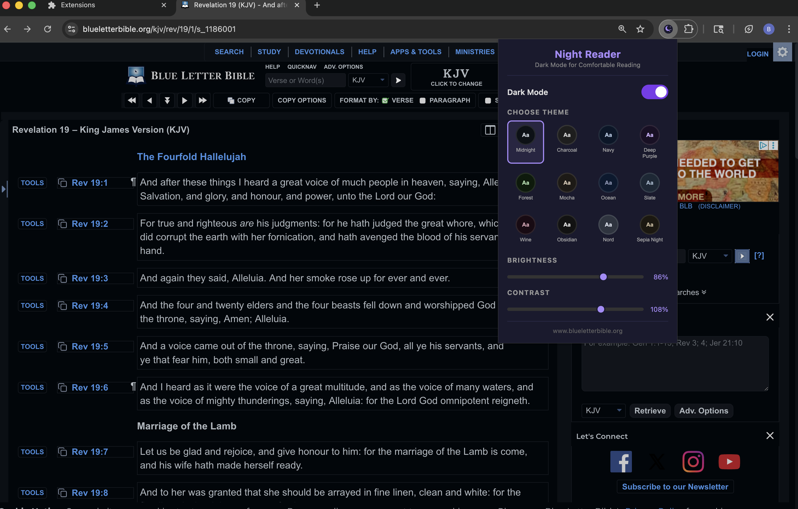
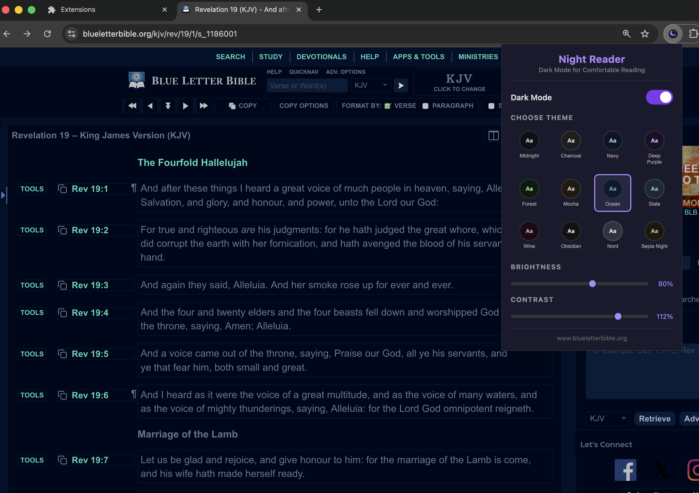
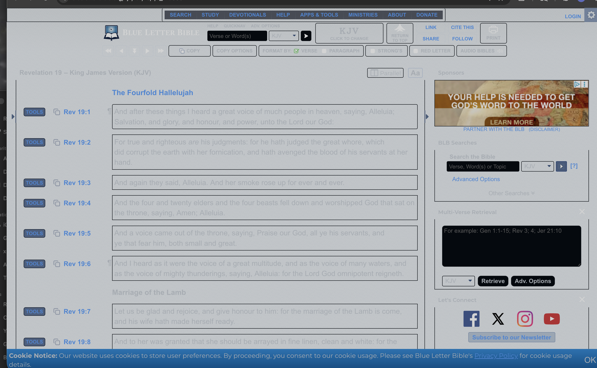

# Night Reader - Dark Mode Chrome Extension

A Chrome extension that applies customizable dark themes to **any website** for comfortable night reading. Built specifically for reading sites like [Blue Letter Bible](https://www.blueletterbible.org/) and any other website you choose.




## Features

- **12 Dark Themes** - Choose from a variety of carefully crafted dark color schemes
- **Universal Dark Mode** - Forces dark backgrounds on ALL elements, even stubborn inline styles
- **Brightness Control** - Adjust from 50% to 100% to find your comfort level
- **Contrast Control** - Fine-tune contrast from 80% to 120%
- **Persistent Settings** - Your preferences are saved and applied automatically
- **Anti-Flash** - Early injection prevents the white flash when pages load
- **Dynamic Content Support** - Watches for new elements and darkens them too
- **Works Everywhere** - Tested on Blue Letter Bible, and works on any website

## Available Themes

| Theme | Background | Best For |
|---|---|---|
| Midnight | `#0d1117` | GitHub-style dark, great default |
| Charcoal | `#1e1e1e` | VS Code-style neutral dark |
| Navy | `#0a1628` | Deep blue, easy on the eyes |
| Deep Purple | `#1a1025` | Rich purple tones |
| Forest | `#0b1a0b` | Green-tinted, nature feel |
| Mocha | `#1e1a16` | Warm brown, cozy reading |
| Ocean | `#0a192f` | Cool blue with teal accents |
| Slate | `#1b2836` | Neutral blue-grey |
| Wine | `#1a0a14` | Warm reddish dark |
| Obsidian | `#121212` | True dark / AMOLED-friendly |
| Nord | `#2e3440` | Popular Nord color scheme |
| Sepia Night | `#1c1810` | Warm sepia for long reading sessions |

## Installation (Step by Step)

### Requirements
- Google Chrome (tested on Version 145.0.7632.117, arm64)
- macOS (tested on macOS 26.3 / Darwin 25.3.0)
- Also works on Windows and Linux with Chrome

### Steps

1. **Download this repository**
   - Click the green **Code** button at the top of this page
   - Select **Download ZIP**
   - Extract the ZIP file to a folder on your computer
   - (Or clone it: `git clone https://github.com/131daniel/night-reader-extension.git`)

2. **Open Chrome Extensions page**
   - Open Google Chrome
   - Type `chrome://extensions/` in the address bar and press Enter

3. **Enable Developer Mode**
   - In the top-right corner of the Extensions page, toggle **Developer mode** ON

4. **Load the extension**
   - Click the **Load unpacked** button (top-left area)
   - Navigate to the folder where you downloaded/extracted this repo
   - Select the folder and click **Open**

5. **Pin the extension** (recommended)
   - Click the puzzle piece icon in Chrome's toolbar (top-right)
   - Find **Night Reader - Dark Mode** and click the pin icon

6. **Start using it**
   - Click the Night Reader icon in your toolbar
   - Toggle **Dark Mode** ON
   - Pick a theme you like
   - Adjust brightness and contrast to your preference
   - Visit any website and enjoy dark mode reading!

### Updating the Extension
If you pull new changes or download a new version:
1. Go to `chrome://extensions/`
2. Find Night Reader and click the refresh icon (circular arrow)
3. Reload any open tabs

## How It Works

- **CSS Injection**: Injects a comprehensive stylesheet that forces dark backgrounds on every element using `!important` overrides
- **Inline Style Stripping**: JavaScript removes inline `background-color`, `background`, and `color` styles that CSS alone can't override
- **MutationObserver**: Watches for dynamically loaded content and applies dark mode to new elements automatically
- **Chrome Storage API**: Persists your settings across browser sessions

## File Structure

```
night-reader-extension/
├── manifest.json      # Chrome extension manifest (Manifest V3)
├── background.js      # Service worker - handles install/update
├── content.js         # Content script - injects dark mode CSS + JS
├── popup.html         # Extension popup UI
├── popup.css          # Popup styling
├── popup.js           # Popup logic and theme management
├── icons/
│   ├── icon16.png     # Toolbar icon
│   ├── icon48.png     # Extensions page icon
│   └── icon128.png    # Chrome Web Store icon
└── screenshots/
    ├── before.png     # Original light mode
    ├── midnight-theme.png  # Midnight theme applied
    └── ocean-theme.png     # Ocean theme applied
```

## Screenshots

### Before (Original Light Mode)


### After - Midnight Theme


### After - Ocean Theme


## Troubleshooting

- **Dark mode not applying?** Make sure the toggle is ON in the popup, then refresh the page
- **Some elements still white?** Try refreshing the page — the MutationObserver should catch dynamic content
- **Extension not visible?** Pin it using the puzzle piece icon in Chrome's toolbar
- **Chrome pages stay white?** Extensions can't modify `chrome://` pages — this is a Chrome security restriction

## Built With

- Chrome Extension Manifest V3
- Vanilla JavaScript (no dependencies)
- Chrome Storage API
- MutationObserver API

## License

Free to use and share. Built with Claude Code by Anthropic.

---

*Built for comfortable night reading of the Word and any other website.*
